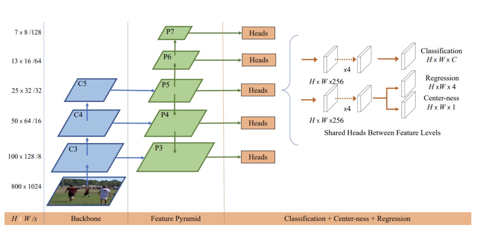

# FCOS
Implementation of FCOS: A Simple and Strong Anchor-free Object Detector

Fully convolutional one-stage object detection (FCOS) is a framework for per-pixel prediction of objects in images. FCOS doesn't rely on expensive anchor box calculations and their hyper-parameters, which is in contrast to state-of-the-art object detectors like RetinaNet, YOLOv3, and Faster R-CNN.

This repository contains an open-source implementation of FCOS in Python with a [notebook](https://github.com/aizamaksutova/FCOS/blob/main/fcos_1%20(1).ipynb) on how to implement the FCOS architecture step-by-step and [code](https://github.com/aizamaksutova/FCOS/blob/main/fcos.py) for the base classes for the FCOS implementation.

# Model architecture
Architecture of FCOS which you can see implemented in the [code](https://github.com/aizamaksutova/FCOS/blob/main/fcos.py)

### Credits
This implementation is heavily based on the [assignment](https://www.eecs.umich.edu/courses/eecs442-ahowens/fa22/psets/ps7.pdf) in UMichigan on FCOS implementation
